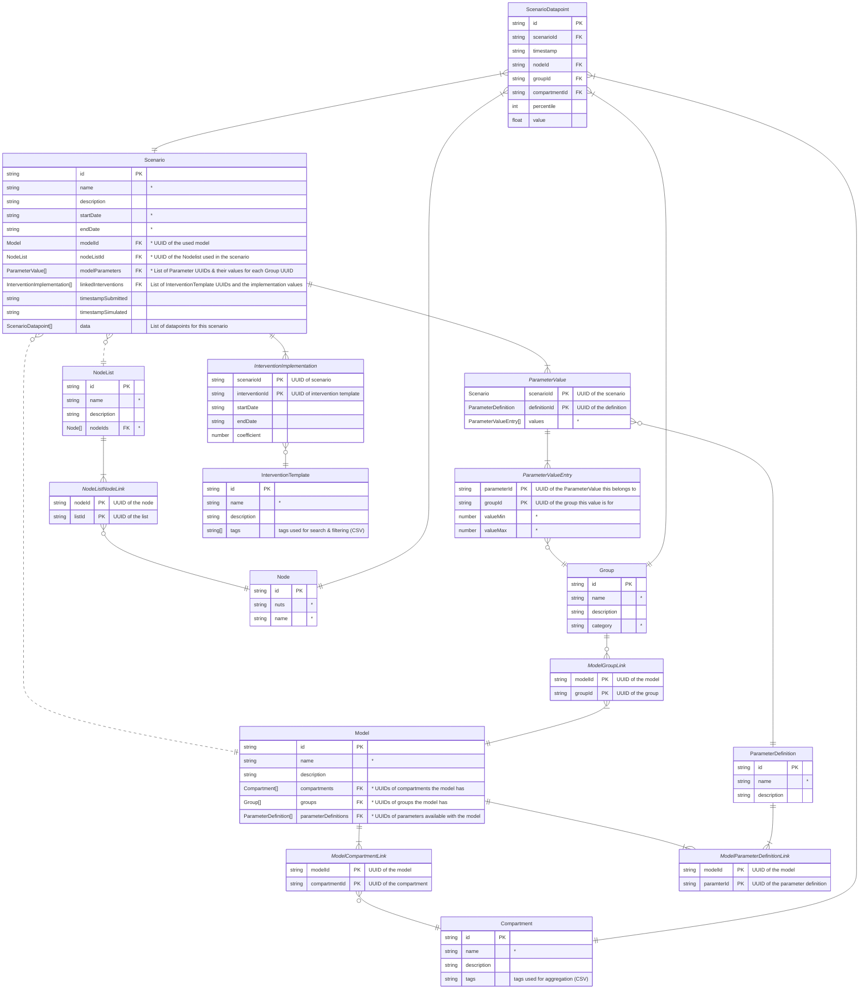

# Entity-Relationship-Diagram

```mermaid
erDiagram
    Scenario {
        string id PK
        string name "*"
        string description
        string startDate "*"
        string endDate "*"
        Model modelId FK "* UUID of the used model"
        NodeList nodeListId FK "* UUID of the Nodelist used in the scenario"
        ParameterValue[] modelParameters FK "* List of Parameter UUIDs & their values for each Group UUID"
        InterventionImplementation[] linkedInterventions FK "List of InterventionTemplate UUIDs and the implementation values"
        string timestampSubmitted
        string timestampSimulated
        ScenarioDatapoint[] data "List of datapoints for this scenario"
    }

    Scenario }o..|| Model: ""
    Scenario ||--|{ _ParameterValue_: ""
    Scenario }o..|| NodeList: ""
    Scenario ||--|{ _InterventionImplementation_: ""

    Model {
        string id PK
        string name "*"
        string description
        Compartment[] compartments FK "* UUIDs of compartments the model has"
        Group[] groups FK "* UUIDs of groups the model has"
        ParameterDefinition[] parameterDefinitions FK "* UUIDs of parameters available with the model"
    }

    _ParameterValue_ {
        Scenario scenarioId PK "UUID of the scenario"
        ParameterDefinition definitionId PK "UUID of the definition"
        ParameterValueEntry[] values "*"
    }

    _ParameterValueEntry_ {
        string parameterId PK "UUID of the ParameterValue this belongs to"
        string groupId PK "UUID of the group this value is for"
        number valueMin "*"
        number valueMax "*"
    }

    _ParameterValue_ ||--|{ _ParameterValueEntry_: ""
    _ParameterValueEntry_ }o--|| Group: ""
    _ParameterValue_ }o--|| ParameterDefinition: ""

    ParameterDefinition {
        string id PK
        string name "*"
        string description
    }

    NodeList{
        string id PK
        string name "*"
        string description
        Node[] nodeIds FK "*"
    }

    NodeList ||--|{ _NodeListNodeLink_: ""
    _NodeListNodeLink_ }o--|| Node: ""

    Node {
        string id PK
        string nuts "*"
        string name "*"
    }

    _NodeListNodeLink_{
        string nodeId PK "UUID of the node"
        string listId PK "UUID of the list"
    }

    _InterventionImplementation_ }o--|| InterventionTemplate: ""

    _InterventionImplementation_ {
        string scenarioId PK "UUID of scenario"
        string interventionId PK "UUID of intervention template"
        string startDate
        string endDate
        number coefficient
    }

    InterventionTemplate {
        string id PK
        string name "*"
        string description
        string[] tags "tags used for search & filtering (CSV)"
    }

    Group {
        string id PK
        string name "*"
        string description
        string category "*"
    }

    Compartment {
        
        string id PK
        string name "*"
        string description
        string tags "tags used for aggregation (CSV)"
    }

    _ModelCompartmentLink_ {
        string modelId PK "UUID of the model"
        string compartmentId PK "UUID of the compartment"
    }
    Model ||--|{ _ModelCompartmentLink_: ""
    _ModelCompartmentLink_ }o--|| Compartment: ""

    _ModelParameterDefinitionLink_ {
        string modelId PK "UUID of the model"
        string paramterId PK "UUID of the parameter definition"
    }
    Model ||--|{ _ModelParameterDefinitionLink_: ""
    ParameterDefinition ||--|{ _ModelParameterDefinitionLink_: ""

    _ModelGroupLink_ {
        string modelId PK "UUID of the model"
        string groupId PK "UUID of the group"
    }
    Group ||--o{ _ModelGroupLink_: ""
    _ModelGroupLink_ }|--|| Model: ""

    ScenarioDatapoint{
        string id PK
        string scenarioId FK
        string timestamp
        string nodeId FK
        string groupId FK
        string compartmentId FK
        int percentile
        float value
    }
    ScenarioDatapoint }|--|| Scenario: ""
    ScenarioDatapoint }|--|| Node: ""
    ScenarioDatapoint }|--|| Group: ""
    ScenarioDatapoint }|--|| Compartment: ""
```